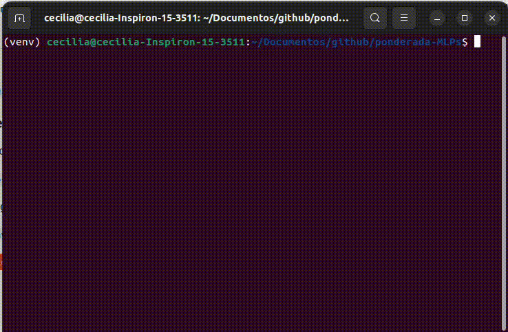
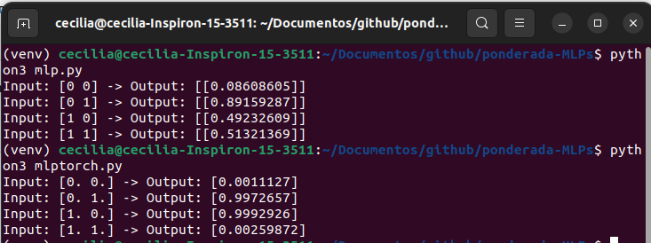

# Ponderada MLPs
Implementar um MLP para resolver o problema do XOR.

## Demonstração de Funcionamento



## Instruções para Execução
### Clone o Repositório
Coloque esse comando no terminal

```git clone https://github.com/cecigonca/ponderada-MLPs.git```

### Ative o Ambiente Virtual (terminal Linux)
Navegue até o diretorio

```/../ponderada-MLPs/```

Rode os comandos seguintes

```python3 -m venv venv```

```source ./venv/bin/activate```

### Pré-requisitos
- **Python 3 ou superior**
- **NumPy** ```pip install numpy```
- **PyTorch** ```pip install torch```

### Importando Dependências

```pip install -r requirements.txt```

```pip freeze > requirements.txt```

### Comandos para rodar a atividade

```python3 mlp.py```

```python3 mlptorch.py```